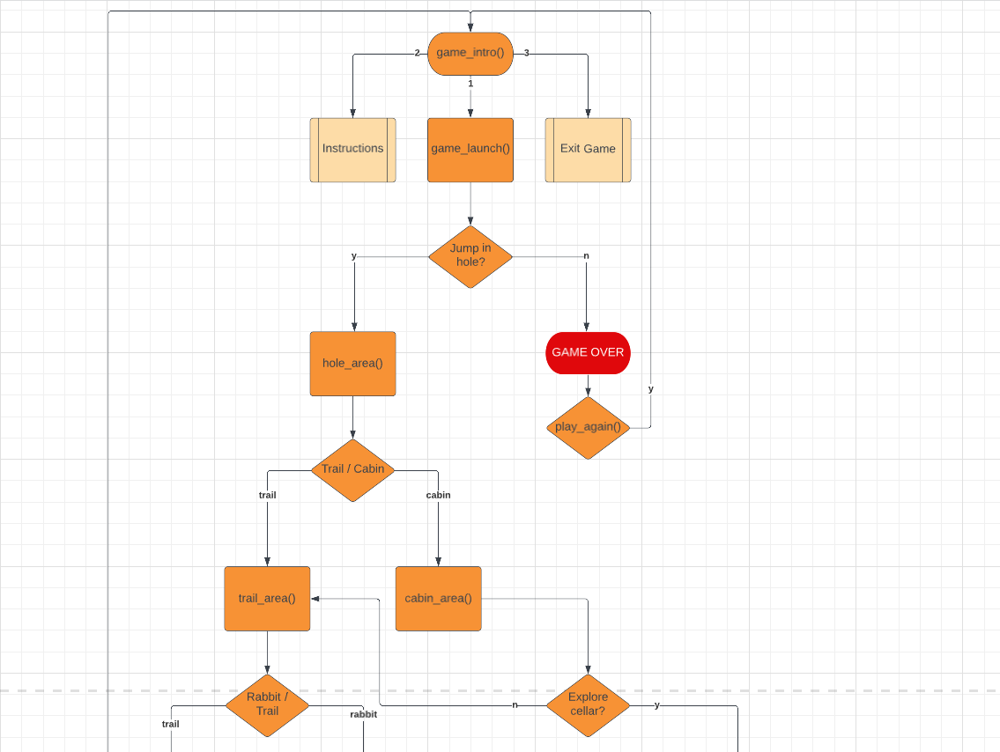
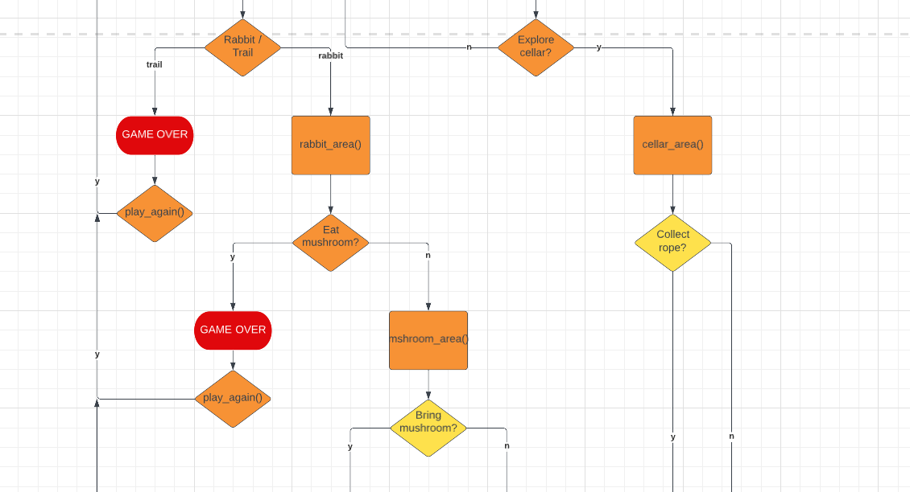
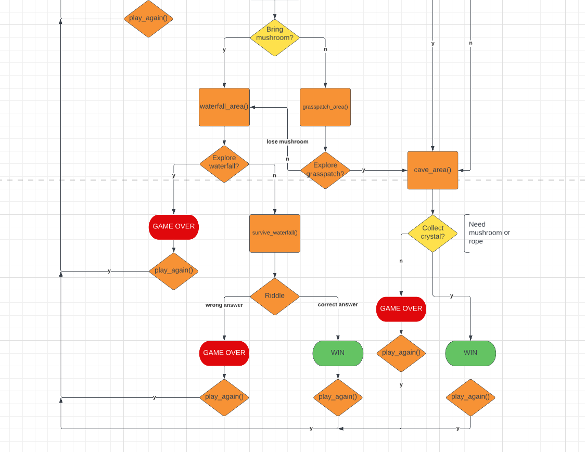
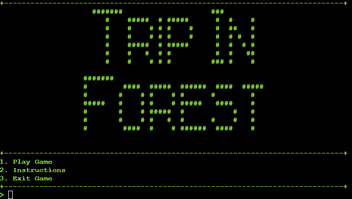
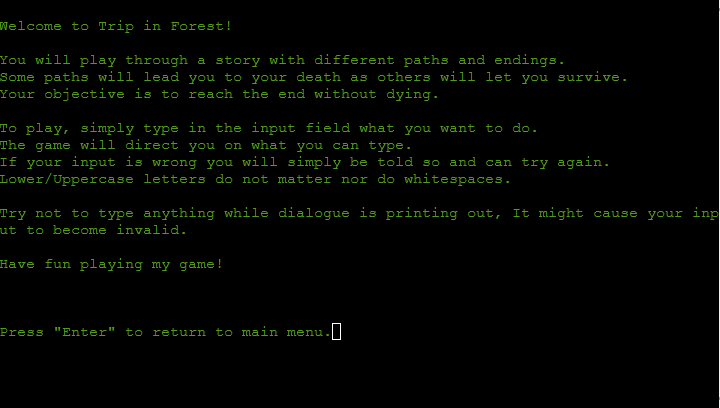
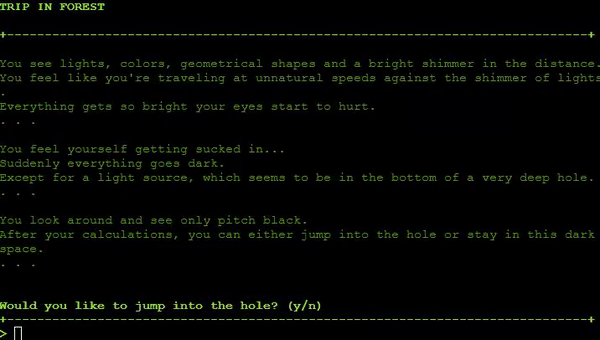
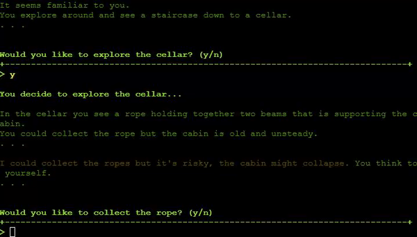
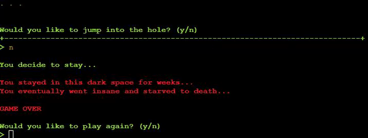
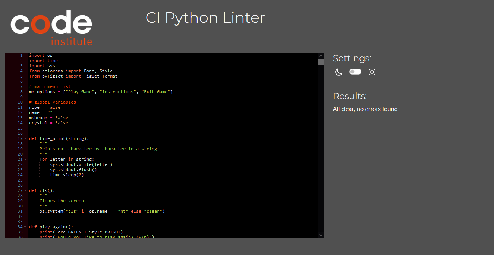

# Trip in Forest

A python text-based adventure game set in a fantasy world. The players objective is to find a way to the ending, there are in total of two endings as the time of writing this. The user will come across choices resulting in death/survival and also get the change to collect items if the player desires. These items will affect how the game is played out.

View the live website [here](https://trip-in-forest.herokuapp.com/).

## Table of Contents

1. [Tutorial](#tutorial)
2. [Vision](#vision)
3. [Features](#features)
4. [Technologies](#technologies)
5. [Testing](#testing)
    1. [CI Python Linter](#ci-python-linter)
    2. [Functional Testing](#functional-testing)
6. [Bugs](#bugs)
7. [Deployment](#deployment)
    1. [Deploying through github pages](#deploying-through-github-pages)
    2. [Fork other repositories](#fork-other-repositories)
    3. [Clone other repositories](#clone-other-repositories)
8. [Credits](#credits)
    1. [Content](#content)

## **Tutorial**

As a text-based adventure game, all you need is a keyboard. The game will present choices for the player to make and they simply types what it wants to do. The goal is to survive through the story.

When first starting the game the player will be presented with a main menu and the title.
Here the player can choose to
1. Start Game
2. Instructions
3. Exit Game

These three options state the obvious, would the player type "1" into the input field, the game starts and the player get to choose their name. All inputs do not go by numbers, the player will sometimes have to answer with "y" for yes or "n" for no. The game will also asks questions such as "Would you like to walk or run?" and the player will have to enter "walk" or "run". All the choices that player has to make will be displayed for them.

If the player makes a typo or an answer unrelated to the situation, the game will tell them the input is invalid and will ask them to try again, capital letters and spaces do not matter.

When player dies/wins they will be asked to play again if they wish to do so.

## **Vision**

Together with my girlfriend we mapped out a simple story. While she was writing with pen and paper, I was mapping out in lucidchart. We both agreed upon the idea that it would be a world of fantasy.

Here are is the lucidchart divided into three screenshots:

  

  

  

## **Features**

* Main Menu
    * Start Game
        * Clears the screen
        * Starts game
    * Instructions
        * Clears the screen
        * Display Instructions
    * Exit Game
        * Quits the game

* Instructions
    * Displays intructions so the player knows how to play.
    * Press "Q" to clear the screen and return to main menu.

* Username
    * Player can choose their own username for the duration of that game.
    * An empty name will result as an invalid input.

* Choices
    * At every point the game asks you a question, you will be presented with two choices.
    * Player makes choice by typing into the input field.
    * Different routes and different endings depending on choice.

 

* Items
    * Player will encounter items they will be asked if they want to pick up.
    * Items can impact gameplay and endings.
    * Some items can not be gathered if they don't meet the requirements for it.

* Announcements
    * Game will display in the terminal whether the player has lost or won.
    * Game will display in the terminal all choices the player makes.

* Replay
    * Give the player an option to replay if they lose or win.

## **Technologies**

* Python
    * Programming language for development of the game.

 

* [Github](https://github.com/)
    * Source code hosted on github and deployed through github pages.

 

* [Git](https://git-scm.com/)
    * Commit and pushing code using git

 

* [Heroku](https://www.heroku.com/home)
    * Deployment of game.

 

* Library [black](https://pypi.org/project/black/)
    * Used to format code.

 

* Library [colorama](https://pypi.org/project/colorama/)
    * Used to change font color.

 

* Library [pyfiglet](https://pypi.org/project/pyfiglet/0.7/)
    * Convert strings to ASCII font art.

 

* Module [time](https://docs.python.org/3/library/time.html)
    * Used to make delays between strings.
    * Used with [sys](https://docs.python.org/3/library/sys.html) to print character by character in a string.

 

* Module [sys](https://docs.python.org/3/library/sys.html)
    * Used with [time](https://docs.python.org/3/library/time.html) to print character by character in a string.

## **Testing**

### **CI Python Linter**

Results:
All clear, no errors found

### **Functional Testing**
 

I manually tested every combination of choices myself, all outputs worked as expected.

* game_intro()
    * The main menu, presented with game title and three options.
        * Start Game
            * When user inputs 1, game launches.
        * Instructions
            * When user inputs 2, show instructions.
        * Exit Game
            * When user inputs 3, quits game.
    * If user enters anything else
        * Error message: "Invalid choice, please choose either 1, 2 or 3.".
        * Try input again.
 
 

* display_instructions()
    * cls() function gets called to clear the console.
    * Prints out instructions.
    * Uses input to press Enter to continue code.
    * Call cls() to clear the console.
    * Call game_intro() returning to main menu.
 
 

* game_launch()
    * Call cls() to clear console.
    * Call get_name() function to let user choose username.
    * Call cls() once again to clear console.
    * Prints story for the user.
    * User gets presented with choice.
        * If user inputs "y", continue game and call function hole_area().
        * If user inputs "n", user lose and call function play_again().
        * If user inputs anything else
            * Error message: "Invalid choice, please choose either y or n".
            * Try input again.
 
 

* hole_area()
    * Prints story for the user.
    * User gets presented with choice.
        * If user inputs "trail", continue game and call function trail_area().
        * If user inputs "cabin", continue game and call function cabin_area().
        * If user inputs anything else
            * Error message: "Invalid choice, please choose either trail or cabin.".
            * Try input again
 
 

* trail_area()
    * Prints story for the user.
        * Calls name variable in story via f-string.
    * User gets presented with choice.
        * If user inputs "rabbit", user lose and call function play_again()
        * If user inputs "trail", continue game and call function rabbit_area()
        * If user inputs anything else
            * Error message: "Invalid choice, please choose either rabbit or trail.".
            * Try input again.
 
 

* cabin_area()
    * Prints story for the user.
    * User gets presented with choice.
        * If user inputs "y", continue game and call function cellar_area().
        * If user inputs "n", continue game and call function trail_area().
        * If user inputs anything else
            * Error message: "Invalid choice, please choose either y or n".
            * Try input again.
 
 

* cellar_area()
    * Prints story for the user.
    * User gets presented with choice.
        * If user inputs "y", set global variable "rope" to True.
            * Continue game and calls function after_rope_area()
        * If user inputs "n", keep global variable "rope" as False.
            * Continue game and calls function after_rope_area()
        * If user inputs anything else
            * Error message: "Invalid choice, please choose either y or n".
            * Try input again.
 
 

* after_rope_area()
    * Prints story for the user.
    * Calls function cave_area().
 
 

* cave_area()
    * Prints story for the user.
    * User gets presented with choice.
        * If user inputs "y"
            * Set global variable "crystal" to True only if global variable "rope" or "mshroom" is True.
            * Game can let you collect crystal only if conditions are met.
            * Calls function cave_exit().
        * If user inputs "n"
            * Keep global variable "crystal" as False.
            * Calls function cave_exit()
        * If user inputs anything else
            * Error message: "Invalid choice, please choose either y or n".
            * Try input again.
 
 

* cave_exit()
    * Prints story for the user.
    * If global variable "crystal" is True
        * Prints story for the user.
        * Calls function player_win()
        * If user comes to this path, they have won.
    * If global variable "crystal" is False
        * Prints story for user.
        * If global variable "mshroom" is True, print extra dialogue.
        * "GAME OVER"
        * Calls function play_again()
 
 

* player_win()
    * Prints ending for user.
    * Call name variable in win message.
    * Call function play_again()
 
 

* rabbit_area()
    * Prints story for the user.
    * User gets presented with choice.
        * If user inputs "y", lose game and call function play_again().
        * If user inputs "n", continue game and call function mshroom_area().
        * If user inputs anything else
            * Error message: "Invalid choice, please choose either y or n".
            * Try input again.
 
 

* mshroom_area()
    * Prints story for the user.
    * User gets presented with choice.
        * If user inputs "y", set global variable "mshroom" to True
            * Call fucntion after_mshroom_area()
        * If user inputs "n" continue game and call fucntion after_mshroom_area()
        * If user inputs anything else
            * Error message: "Invalid choice, please choose either y or n".
            * Try input again.
 
 

* after_mshroom_area()
    * If global variable "mshroom" is True
        * Prints secret path for the user.
        * User gets presented with choice.
            * If user inputs "y", continue game and call function grasspatch_area().
            * If user inputs "n"
                * Set global variable "mshroom" to False.
                * Call function waterfall_area().
            * If user inputs anything else
                * Error message: "Invalid choice, please choose either y or n".
                * Try input again.
    * If global variable "mshroom" is False
        * Call function waterfall_area().
 
 

* waterfall_area()
    * Prints story for the user.
    * User gets presented with choice.
        * If user inputs "y", lose game and call function play_again().
        * If user inputs "n", continue game and call function survive_waterfall().
        * If user inputs anything else
            * Error message: "Invalid choice, please choose either y or n".
            * Try input again.
 
 

* survive_waterfall()
    * Prints story for the user.
    * Gets global variable "name" for use in f-string.
    * User gets presented with a riddle.
        * If user inputs "life", call function player_win().
        * If user inputs anything else
            * User lose game and call function play_again()
 
 

* grasspatch_area()
    * Prints story for the user.
    * Call function cave_area()'
 
 

* play_again()
    * Prints "Would you like to play again?"
    * If user input "y"
        * Call cls() function to clear the console.
        * Call game_intro() function.
    * If user input "n"
        * Print thank you message.
        * Call quit().

 

## **Bugs**

* When typing during dialogue, correct input will display as invalid.
* Colorama will sometimes display wrong color after invalid input.

Bugs will be fixed in the future as I do not have the time due to project deadline or the knowledge.
 

## **Deployment**

### **Deploying through Heroku**
How to deploy your app to Heroku.

1. Create a [Heroku](https://www.heroku.com/home) account if you don't have one.
2. In your dashboard, click "Create new app".
3. In your new app, navigate to Settings where you will add Config Vars and Buildpacks.
4. Create a Config Vars
    1. Click "Reveal Config Vars"
    2. Set "KEY" to PORT and "VALUE" to 8000.
    3. Click "Add"
5. Scroll down to Buildpacks.
    1. Click "Add buildpack".
    2. Select Python, then save changes.
    3. Do the same for NodeJS.
    4. Your buildpacks should be in following order:
        1. Python
        2. NodeJS
6. Navigate to Deploy tab.
7. Select GitHub as deployment method.
8. Connect to GitHub.    
9. Search for the GitHub repository you wish to deploy.
10. Click "Connect"
11. You can choose Automatic or Manual deployment, up to preference.
12. Once finished deploying, click "View" to view your app on Heroku.

 

### **Fork other repositories**
1. Go to desired repository.
2. Click "Fork" in the upper-right corner.
3. Select owner, set repository name and add description(optional).
4. Choose to copy default or all branches.
5. Click "Create Form".
 

### **Clone other repositories**
1. In your selected repository, click "Code" drop down button.
2. Select desired cloning method (HTTP)
3. Copy repository to clipboard
4. Open IDE of choice.
5. Type "git clone copied-git-url" into the IDE terminal. (Need git installed) 
 

## **Credits**

* [Clear interpreter console](https://stackoverflow.com/questions/517970/how-to-clear-the-interpreter-console)
    * Used this forum as a tutorial for clearing the interpreter console.

 

* [Print one character by character in a string](https://stackoverflow.com/questions/9246076/how-to-print-one-character-at-a-time-on-one-line)
    * Used this forum as a tutorial for printing character by character in strings.

 

* [Colorama - Font color](https://pypi.org/project/colorama/)
    * Different font colors depending on which dialogue. (Blue = NPC, Red = Lose etc..)

 

* [Pyfiglet - ASCII font art](https://pypi.org/project/pyfiglet/0.7/)
    * ASCII font art for main menu title.

 

* [ezGIF](https://ezgif.com/)
    * Convert .mp4 to .gif for readme.

* Mentor, Daisy Mc Girr
 